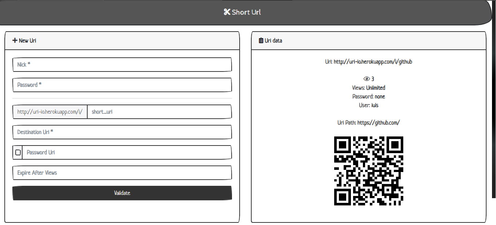

# Short Url

---------------

  
🇪🇸 Descripcion en Español

  - Crea Codigos QR en Base a Una Url.
  - Contabiliza las entradas a tu enlace.
  - Protege tu direccion con una contraseña.
  - Gestiona Tus Url.
  - Crea Url Temporales.

---------------

  
💻 Dev

  ## Variables de Entorno

  - MONGOCONNECTION
  - MONGOCONNECTION_TEST
  - DELETEPSW

---------------

## Contributors

- <a href="https://github.com/LuisFOsG" target="_blank">LuisFOsG</a>
- <a href="https://github.com/BryanSMC" target="_blank">BryanSMC</a>
